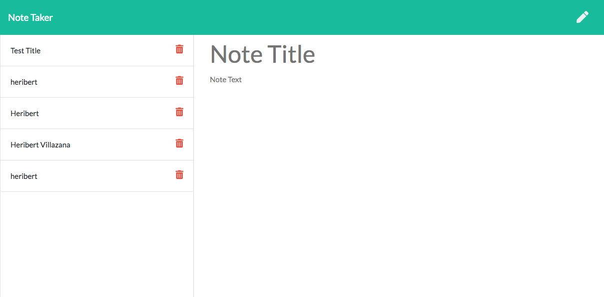

# Note-Taker
Application that can be used to write, save, and delete notes

* **The final and deployed page looks like this**

### You can access here: [Home Page](https://infinite-river-35558.herokuapp.com/)

* The following Gif/video demostrates the app Functionality

* Adding note:

This project was made taking in consideration the requirements from Columbia Coding Boot Camp:

Create an application that can be used to write, save, and delete notes. This application will use an express backend and save and retrieve note data from a JSON file.

## Acceptance Criteria

Application should allow users to create and save notes.

Application should allow users to view previously saved notes.

Application should allow users to delete previously saved notes.

# Description

In the Business Context For users that need to keep track of a lot of information, it's easy to forget or be unable to recall something important. Being able to take persistent notes allows users to have written information available when needed.

# Usage
In your commandline, while in the directory where your server.js file is, run "node server.js". Output will be generated in the directory output with name "team.html"

# Contribution
If you would like to contribute please create an issue. Alternatively, clone this repo and make modifications to your copy.

# Test
Remember, you can run the tests at any time with `npm run test`

# Author
* Heribert Villazana
* Github: herivillaz

## Contact
herivillaz@gmail.com